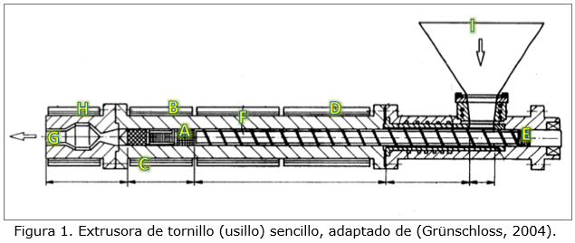

## Información inicial
**Empresa:**
<br>Se dedica a la producción de piezas automotrices a base de Polipropileno<br>
**Problema:**
<br>El porcentaje de defectos está por los cielos<br>

**Objetivo:**
<br>Determinar las variables importantes para el proceso de extrusión de Polipropileno en una máquina de tornillo sencillo para mejorar la producción.<br>
**Métrica:**
<br>Porcentaje de producto defectuoso (cociente entre los defectuosos y el total producido)<br>

| Porcentaje actual | Porcentaje máximo |
|:-----------------:|:-----------------:|
|        40%        |        16%        |

## Máquina de extrusión: Welex

<br>
**Información técnica:**
<br>Hay 9 variables que podrían afectar la calidad del producto (A-I)<br>

| ID | Variable                            | Unidades |
|:--:|:-----------------------------------:|:--------:|
| A  | Presión bomba                       |    Bar   |
| B  | Temperatura plástico 3 (bomba)      |    °C    |
| C  | Temperatura plástico 4 (mezcladora) |    °C    |
| D  | Temperatura tornillo (usillo)       |    °C    |
| E  | RPM tornillo (usillo)               |    rpm   |
| F  | Temperatura barril                  |    °C    |
| G  | Velocidad extrusión                 |    m/s   |
| H  | Temperatura enfriadores             |    °C    |
| I  | Tipo materia prima                  |    ---   |
| Y  | Porcentaje de defectos              |     %    |


## Preparación del entorno y de los datos
```{r, message=FALSE}
#install.packages("readxl")   # Read Excel Files
library(readxl)
#install.packages("dplyr")    # A Grammar of Data Manipulation
library(dplyr)
#install.packages("skimr")    # Compact and Flexible Summaries of Data 
library(skimr)
#install.packages("psych")    # Personality/Psychometric/Psychological research
library(psych)
#install.packages("GGally")   # Extension to 'ggplot2'
library(GGally)
#install.packages("Hmisc")    # Harrell Miscellaneous
library(Hmisc)
#install.packages("corrplot") # Visualization of a Correlation Matrix 
library(corrplot)
```

```{r, message=FALSE}
# Leer info de la producción
datos <- read_excel("./Datos_reto.xlsx", sheet=3, skip=1)
attach(datos)

data <- rename(datos, P_bomba     = A,
       T_plastic3     = B,
       T_plastic4     = C,
       T_tornillo     = D,
       RPM_tornillo   = E,
       T_barril       = F,
       V_extrusión    = G,
       T_enfriadores  = H,
       Tipo_matPrima  = I,
       PCT_defectos   = Y)
```

```{r, message=FALSE}
# Revisón rápida de los datos
skimr::skim(data)
```


## Exploración inicial de los datos
Para ver la relación entre ellos e identificar cuáles son los más apropiados para usar en nuestra regresión
```{r, message=FALSE}
#pairs(datos, pch=20) # Para ir buscando relaciones entre las variables

# 1.CHECAR LA DISTRIBUCIÓN NORMAL mediante histogramas  
multi.hist(x=data, dcol=c("blue", "red"), dlty=c("dotted", "solid"), lwd=c(2, 1), main=c("P_bomba", "T_plastic3", "T_plastic4", "T_tornillo", "RPM_tornillo", "T_barril", "V_extrusión", "T_enfriadores", "Tipo_matPrima", "PCT_defectos"))
```
```{r, message=FALSE}
# 2.IDENTIFICAR VARIABLES CON CORRELACIÓN ALTA, pues podrían representar un problema
ggpairs(data)

ggpairs(datos, upper=list(continuous="smooth"), lower=list(continuous="blank"), diag=list(continuous="densityDiag"))

rcorr(as.matrix(datos))

corrplot(cor(data)) # Correlograma
```

<<<<<<< HEAD

=======
<<<<<<< HEAD
=======

>>>>>>> 1d2d0247898f43481e1d3c5eb322afc3caf5272d
>>>>>>> fde2b3133ee506146984acec53304795ce81feca
## Modelo de regresión lineal múltiple

```{r}
modeloRM <- lm(Y~A+B+C+D+E+F+G+H+I)
summary(modeloRM)
anova(modeloRM)

```


Si quitamos las variables velocidad extrusión (G), temperatura enfriadores (H) y tipo materia prima (I) que en el modelo pasado tenían un valor p mayor a alfa (0.05), esto es lo que queda
```{r}
modeloRM2 <- lm(Y~A+B+C+D+E+F)
summary(modeloRM2)
anova(modeloRM2)

```

Después de hacer este segundo modelo observamos que R^2 ajustada casi no cambió y sigue siendo un valor aceptable. En cuanto a los valores p de las variables, todos están por debajo del valor alfa (0.05).
\
Ahora vamos a usar la función _step()_ para obtener el mejor modelo de regresión lineal múltiple.
```{r}
step(modeloRM)
```

De acuerdo con la función _step()_, el mejor modelo es utilizando las variables A,B,C,D,E y F y se rechaza la hiótesis nula, por lo que también conservamos el valor del intercepto. La R^2 ajustada tiene un valor de 0.7293. 


